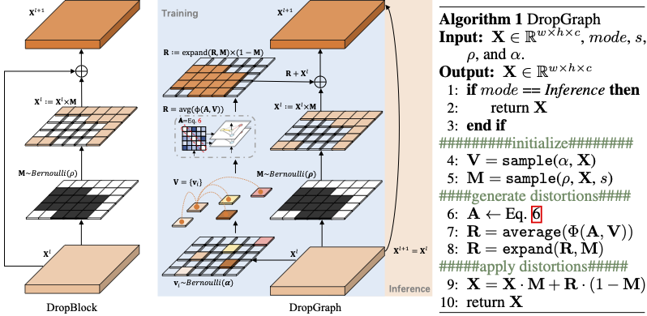

# DropGraph
Official implementation of "Partial Graph Reasoning for Neural Network Regularization"

Project page: https://dropgraph.github.io/  
Paper: *coming soon*

## Code 

**Code comming soon, stay tuned!**

This repo. contains PyTorch implementation of the following modules:
- [ ] Implementation of distortion generation layers with basic gcn layers;
- [ ] The complete implementation of DropGraph pipeline;
- [ ] All experimented schedulers;
- [ ] Training scripts;

## Citation  

*coming soon*